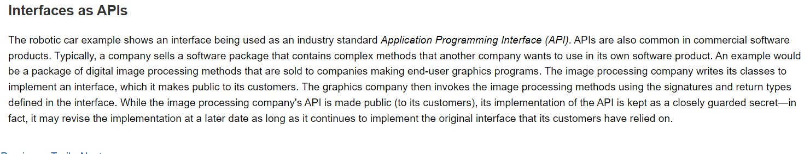
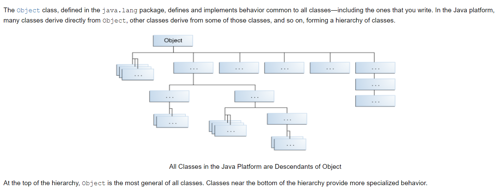
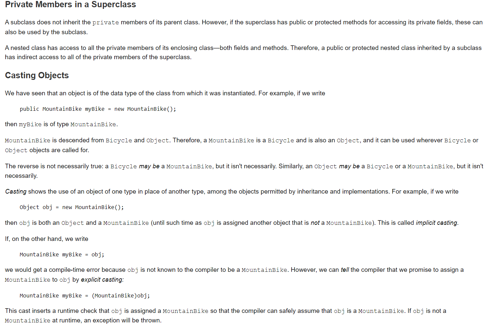

# Inheritance and Interfaces

## Interfaces

**Interface** is a reference type in java, similar to a class, that can contain only constants, method signatures, default methods, static methods, and nested types. Method bodies exist only for default methods and static methods. **Interfaces** cannot be instantiated—they can only be implemented by classes or **extended** by other **interfaces**.

```java
public interface OperateCar {

   // constant declarations, if any

   // method signatures
   
   // An enum with values RIGHT, LEFT
   int turn(Direction direction,
            double radius,
            double startSpeed,
            double endSpeed);
   int changeLanes(Direction direction,
                   double startSpeed,
                   double endSpeed);
   int signalTurn(Direction direction,
                  boolean signalOn);
   int getRadarFront(double distanceToCar,
                     double speedOfCar);
   int getRadarRear(double distanceToCar,
                    double speedOfCar);
         ......
   // more method signatures
}
```

It's doesn't have braces and are terminated with a semicolon.

**to use an interface, you have to implemrnts it to the class.**

```java
public class OperateBMW760i implements OperateCar {

    // the OperateCar method signatures, with implementation --
    // for example:
    public int signalTurn(Direction direction, boolean signalOn) {
       // code to turn BMW's LEFT turn indicator lights on
       // code to turn BMW's LEFT turn indicator lights off
       // code to turn BMW's RIGHT turn indicator lights on
       // code to turn BMW's RIGHT turn indicator lights off
    }

    // other members, as needed -- for example, helper classes not 
    // visible to clients of the interface
}
```


## Inheritance

**Definitions:** A class that is derived from another class is called a subclass (also a derived class, extended class, or child class). The class from which the subclass is derived is called a superclass (also a base class or a parent class).

**The idea of inheritance is to use the same class instead of create another one.**

### The Java Platform Class Hierarchy



**Example:**

Here is the sample code for a possible implementation of a ```Bicycle``` class that was presented in the Classes and Objects lesson:

```java
public class Bicycle {
        
    // the Bicycle class has three fields
    public int cadence;
    public int gear;
    public int speed;
        
    // the Bicycle class has one constructor
    public Bicycle(int startCadence, int startSpeed, int startGear) {
        gear = startGear;
        cadence = startCadence;
        speed = startSpeed;
    }
        
    // the Bicycle class has four methods
    public void setCadence(int newValue) {
        cadence = newValue;
    }
        
    public void setGear(int newValue) {
        gear = newValue;
    }
        
    public void applyBrake(int decrement) {
        speed -= decrement;
    }
        
    public void speedUp(int increment) {
        speed += increment;
    }
        
}
```

A class declaration for a ```MountainBike``` class that is a subclass of ```Bicycle``` might look like this:

```java
public class MountainBike extends Bicycle {
        
    // the MountainBike subclass adds one field
    public int seatHeight;

    // the MountainBike subclass has one constructor
    public MountainBike(int startHeight,
                        int startCadence,
                        int startSpeed,
                        int startGear) {
        super(startCadence, startSpeed, startGear);
        seatHeight = startHeight;
    }   
        
    // the MountainBike subclass adds one method
    public void setHeight(int newValue) {
        seatHeight = newValue;
    }   
}
```

### What You Can Do in a Subclass

- The inherited fields can be used directly, just like any other fields.
- You can declare a field in the subclass with the same name as the one in the superclass, thus hiding it (not recommended).
- You can declare new fields in the subclass that are not in the superclass.
- The inherited methods can be used directly as they are.
- You can write a new instance method in the subclass that has the same signature as the one in the superclass, thus overriding it.
- You can write a new static method in the subclass that has the same signature as the one in the superclass, thus hiding it.
- You can declare new methods in the subclass that are not in the superclass.
- You can write a subclass constructor that invokes the constructor of the superclass, either implicitly or by using the keyword super.


