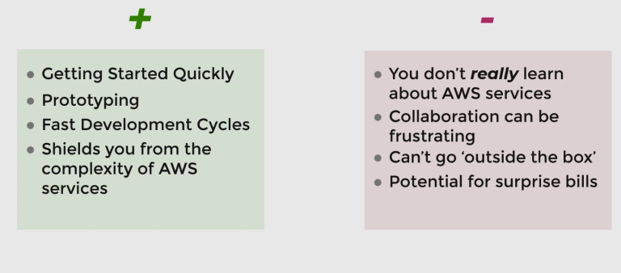

# Amplify

AWS Amplify is a set of purpose-built tools and features that lets frontend web and mobile developers quickly and easily build full-stack applications on AWS, with the flexibility to leverage the breadth of AWS services as your use cases evolve.

## Pros and Cons of Amplify

**Pros:**

1. Getting Started Quickly
    Amplify lets you deploy get started with new projects quickly.
2. Fast Development Cycles
    Developers can take advantage of the toolkit to rapidly experiment with new changes and deploy them out to the cloud.
3. Shielding From the Complexity of AWS
    Amplify offers a solution oriented mindset. By offering direct functions or features as components such as Storage, Authentication, Analytics, and others, developers don’t need to care about which AWS services are being used behind the scenes, they generally just worry about the end product.

**Cons:**

1. You Don’t ‘Really’ Learn AWS
    you’re probably not gonna learn how to use AWS, you’re just going to learn how to use amplify.
2. Collaboration Can Be Frustrating
3. Stepping Outside The Box
    One of the problems with Amplify is that you’re kind of at the mercy of the product features offered through AWS Amplify.
4. Potential For Surprise Bills
    Because services are being provisioned behind the scenes, there is the possibility you can add a functionality that relies on a service with cost implications.
