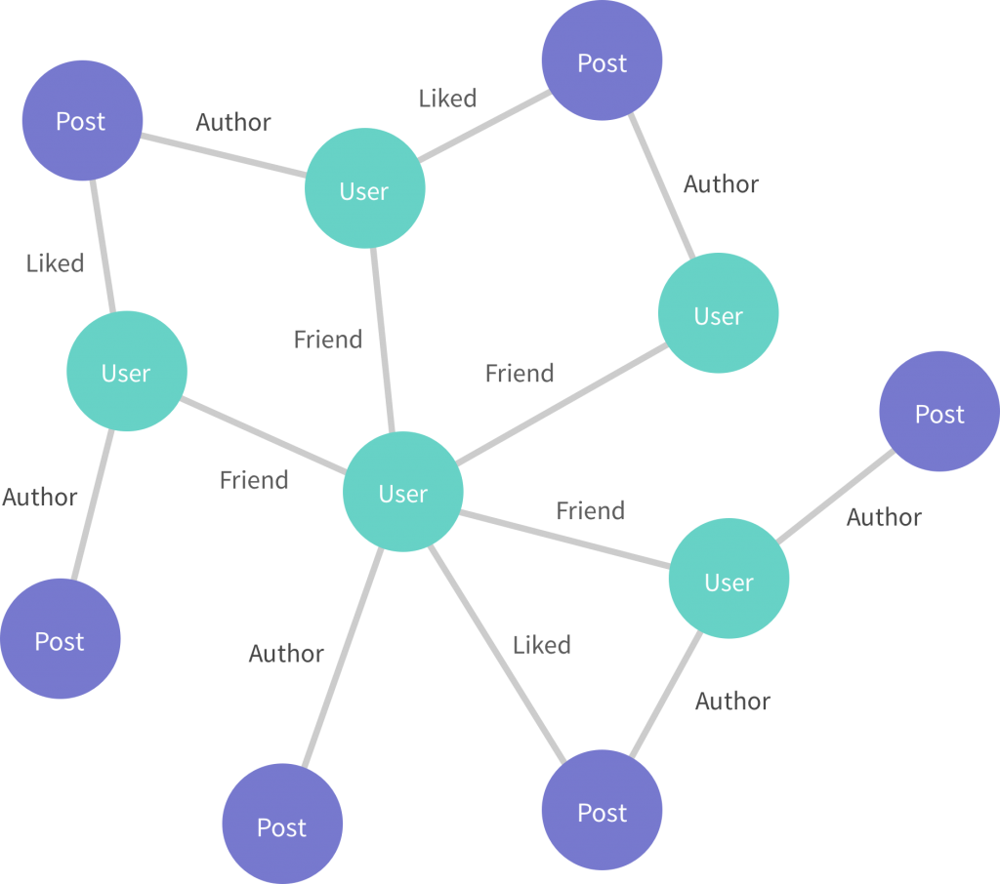

# GraphQL @connection

The most popular method for pagination in GraphQL are GraphQL connections.

connections use opaque vocabulary like "cursor", "connection", amd "edge".

## Some Graph Theory Nomenclature



The circles in the graph are called “nodes” and the lines of the graph are called “edges.” An edge is a line that connects two nodes together, representing some kind of relationship between the two nodes.

## Data Modeling

Amplify automaticlly creates database tables for GraphQL, you can create relations between the data models via the (@hasOne, @hasMany, @belongs, and @manyToMany) directives.

| Relationship  | Description   |
| :------------ |:-------------:|
|  @hasOne   | Create a one-directional one-to-one relationship between two models. For example, a Project "has one" Team. This allows you to query the team from the project record. |
|  @hasMany   | Create a one-directional one-to-many relationship between two models. For example, a Post has many comments. This allows you to query all the comments from the post record. |
|  @belongsTo  | Use a "belongs to" relationship to make a "has one" or "has many" relationship bi-directional. For example, a Project has one Team and a Team belongs to a Project. This allows you to query the team from the project record and vice versa. |
| @manyToMany   | Configures a "join table" between two models to facilitate a many-to-many relationship. For example, a Blog has many Tags and a Tag has many Blogs. |

```
The @hasOne and @hasMany directives do not support referencing a model which then references the initial model via @hasOne or @hasMany if DataStore is enabled.
```

## Using CompletableFuture as a Simple Future

the CompletableFuture class implements the Future interface, so we can use it as a Future implementation, but with additional completion logic.

For example, we can create an instance of this class with a no-arg constructor to represent some future result, hand it out to the consumers, and complete it at some time in the future using the complete method. The consumers may use the get method to block the current thread until this result is provided.

```java
public Future<String> calculateAsync() throws InterruptedException {
    CompletableFuture<String> completableFuture = new CompletableFuture<>();

    Executors.newCachedThreadPool().submit(() -> {
        Thread.sleep(500);
        completableFuture.complete("Hello");
        return null;
    });

    return completableFuture;
}
```

To spin off the computation, we use the Executor API. This method of creating and completing a CompletableFuture can be used together with any concurrency mechanism or API, including raw threads.

**the calculateAsync method returns a Future instance.**

Also observe that the get method throws some checked exceptions, namely ExecutionException (encapsulating an exception that occurred during a computation) and InterruptedException (an exception signifying that a thread executing a method was interrupted):

```java
Future<String> completableFuture = calculateAsync();

// ... 

String result = completableFuture.get();
assertEquals("Hello", result);
```

we can use the static completedFuture method with an argument that represents a result of this computation. 

```java
Future<String> completableFuture = 
  CompletableFuture.completedFuture("Hello");

// ...

String result = completableFuture.get();
assertEquals("Hello", result);
```
