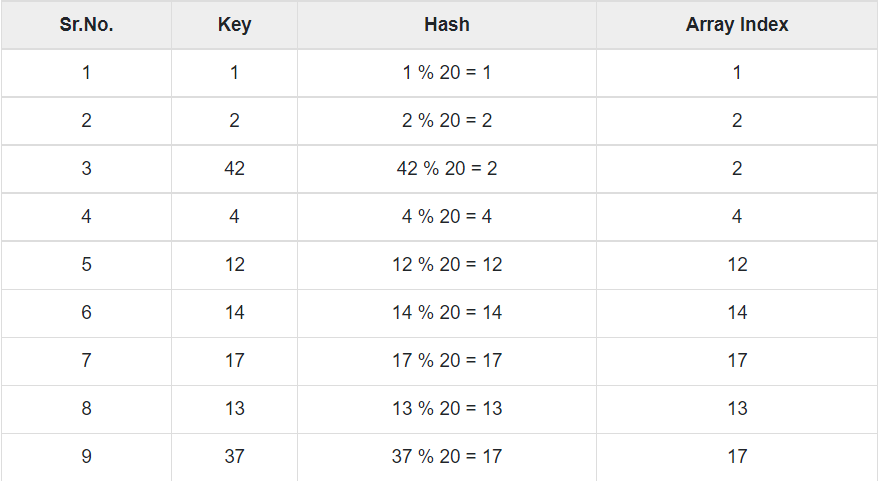

# Hashtables

Hash Table is a data structure which stores data in an associative manner. In a hash table, data is stored in an array format, where each data value has its own unique index value.

## Hashing

Hashing is a technique to convert a range of key values into a range of indexes of an array




## Basic Operations

1. **Search** − Searches an element in a hash table.

    ```java
        struct DataItem *search(int key) {
    //get the hash
    int hashIndex = hashCode(key);
        
    //move in array until an empty
    while(hashArray[hashIndex] != NULL) {
        
        if(hashArray[hashIndex]->key == key)
            return hashArray[hashIndex];
                
        //go to next cell
        ++hashIndex;
            
        //wrap around the table
        hashIndex %= SIZE;
    }

    return NULL;        
    }
    ```

2. **Insert** − inserts an element in a hash table.

    ```java
        void insert(int key,int data) {
    struct DataItem *item = (struct DataItem*) malloc(sizeof(struct DataItem));
    item->data = data;  
    item->key = key;     

    //get the hash 
    int hashIndex = hashCode(key);

    //move in array until an empty or deleted cell
    while(hashArray[hashIndex] != NULL && hashArray[hashIndex]->key != -1) {
        //go to next cell
        ++hashIndex;
            
        //wrap around the table
        hashIndex %= SIZE;
    }
        
    hashArray[hashIndex] = item;        
    }
    ```

3. **delete** − Deletes an element from a hash table.

    ```java
        struct DataItem* delete(struct DataItem* item) {
        int key = item->key;

        //get the hash 
        int hashIndex = hashCode(key);

        //move in array until an empty 
        while(hashArray[hashIndex] !=NULL) {
            
            if(hashArray[hashIndex]->key == key) {
                struct DataItem* temp = hashArray[hashIndex]; 
                    
                //assign a dummy item at deleted position
                hashArray[hashIndex] = dummyItem; 
                return temp;
            } 
                
            //go to next cell
            ++hashIndex;
                
            //wrap around the table
            hashIndex %= SIZE;
        }  
            
        return NULL;        
        }
    ```
