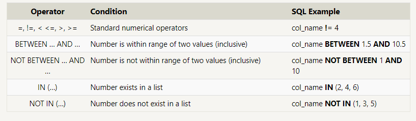

# Introduction To SQL

## SELECT & FROM

1. SELECT indicates which column(s) you want to be given the data for.

2. FROM specifies from which table(s) you want to select the columns. Notice the columns need to exist in this table.
If you want to be provided with the data from all columns in the table, you use "*", like so:

- SELECT * FROM orders
Note that using SELECT
 does not create a new table with these columns in the database, it just provides the data to you as the results, or output, of this command.

Example:

```SQL
    SELECT *
    FROM orders;
```

```SQL
    select Title
    from movies;
```

***

## Queries with constraints

```SQL
    SELECT column, another_column, …
    FROM mytable
    WHERE condition
        AND/OR another_condition
        AND/OR …;
```

Using the WHERE statement, we can display subsets of tables based on conditions that must be met. You can also think of the WHERE command as filtering the data.
This video above shows how this can be used, and in the upcoming concepts, you will learn some common operators that are useful with the WHERE' statement.\
Common symbols used in WHERE statements include:



**Examples**

- FInd Movie in **id** row 6:

```SQL
    select Title from movies
    WHERE id = 6 ;
```

- Find the movies released in the **year's** berween 2000 and 2010:

```SQL
    select *Title* from movies
    WHERE year BETWEEN 20000 AND 2010;
```

- Find all the Toy Story movies:

```SQL
    SELECT * FROM movies
    WHERE title LIKE "%Toy Story%";
```

- Find all the movies (and director) not directed by John Lasseter:

```SQL
    SELECT * FROM movies
    WHERE NOT Director LIKE "%John Lasseter%";
```

***

## Filtering and sorting Query results

- **ORDER BY:** The ORDER BY statement allows us to sort our results using the data in any column.

```SQL
    SELECT column, another_column, …
    FROM mytable
    WHERE condition(s)
    ORDER BY column ASC/DESC
```

Example:

List all directors of Pixar movies (alphabetically), without duplicates.

```SQL
    SELECT DISTINCT director FROM movies
    ORDER BY director ASC;
```

- **LIMIT:** The LIMIT statement is useful when you want to see just the first few rows of a table.

```SQL
    SELECT column, another_column, …
    FROM mytable
    WHERE condition(s)
    ORDER BY column ASC/DESC
    LIMIT num_limit OFFSET num_offset;
```

Example:

1. List the last four Pixar movies released (ordered from most recent to least).

    ```SQL
        SELECT title, year FROM movies
        ORDER BY year DESC
        LIMIT 4;
    ```

2. list the next five Pixar movies sorted alphabetically.

    ```SQL
        SELECT title FROM movies
        ORDER BY title ASC
        LIMIT 5 OFFSET 5;
    ```

***

## Multi-table queries with JOINs

The **INNER JOIN** is a process that matches rows from the first table and the second table which have the same key (as defined by the ON constraint) to create a result row with the combined columns from both tables. After the tables are joined, the other clauses we learned previously are then applied.

```SQL
    SELECT column, another_table_column, …
    FROM mytable
    INNER JOIN another_table 
        ON mytable.id = another_table.id
    WHERE condition(s)
    ORDER BY column, … ASC/DESC
    LIMIT num_limit OFFSET num_offset;
```

**Example:**


1. Find the domestic and international sales for each movie

    ```SQL
        SELECT *,Domestic_sales,International_sales 
        FROM movies
        INNER JOIN Boxoffice
            ON movies.id = Boxoffice.Movie_id;
    ```

2. Show the sales numbers for each movie that did better internationally rather than domestically

    ```SQL
        SELECT title, domestic_sales, international_sales
        FROM movies
        JOIN boxoffice
            ON movies.id = boxoffice.movie_id
        WHERE international_sales > domestic_sales;
    ```

3. List all the movies by their ratings in descending order

    ```SQL
        SELECT *, Rating
        FROM movies
        JOIN boxoffice
            ON movies.id = boxoffice.movie_id
        ORDER BY rating DESC;
    ```

## OUTER JOINs

***
Like the INNER JOIN these three new joins have to specify which column to join the data on.
When joining table A to table B, a LEFT JOIN simply includes rows from A regardless of whether a matching row is found in B. The RIGHT JOIN is the same, but reversed, keeping rows in B regardless of whether a match is found in A. Finally, a FULL JOIN simply means that rows from both tables are kept, regardless of whether a matching row exists in the other table.

1. LEFT JOIN - pulls all the data that exists in both tables, as well as all of the rows from the table in the FROM even if they do not exist in the JOIN statement.

2. RIGHT JOIN - pulls all the data that exists in both tables, as well as all of the rows from the table in the JOIN even if they do not exist in the FROM statement.

``` SQL
    SELECT column, another_column, …
    FROM mytable
    INNER/LEFT/RIGHT/FULL JOIN another_table 
        ON mytable.id = another_table.matching_id
    WHERE condition(s)
    ORDER BY column, … ASC/DESC
    LIMIT num_limit OFFSET num_offset;
```

**Example:**


1. Find the list of all buildings that have employees.

    ``` SQL
        SELECT DISTINCT building 
        FROM employees;
    ```

2. List all buildings and the distinct employee roles in each building (including empty buildings).

    ``` SQL
    SELECT DISTINCT building_name, role 
    FROM buildings 
    LEFT JOIN employees
        ON building_name = building;
    ```

## A short note on NULLs

***

```SQL
    SELECT column, another_column, …
    FROM mytable
    WHERE column IS/IS NOT NULL
    AND/OR another_condition
    AND/OR …;
```

**Examples:**


1. Find the name and role of all employees who have not been assigned to a building

     ```SQL
        SELECT * 
        FROM employees
        WHERE building is NULL;
    ```

2. Find the names of the buildings that hold no employees.

    ```SQL
        SELECT DISTINCT building_name
        FROM buildings 
        LEFT JOIN employees
            ON building_name = building
        WHERE role IS NULL;
    ```

## Queries with expressions

***


**Examples:**


1. List all movies and their combined sales in millions of dollars

     ```SQL
        SELECT title, (domestic_sales + international_sales) / 1000000 AS gross_sales_millions
        FROM movies
        JOIN boxoffice
        ON movies.id = boxoffice.movie_id;
    ```

2. List all movies and their ratings **in percent**

    ```SQL
        SELECT title, rating * 10 AS rating_percent
        FROM movies
        JOIN boxoffice
            ON movies.id = boxoffice.movie_id;
    ```

3. List all movies that were released on even number years.

     ```SQL
        SELECT title, year
        FROM movies
        WHERE year % 2 = 0;
    ```

***

## Queries with aggregates

```SQL
     SELECT AGG_FUNC(column_or_expression) AS aggregate_description, …
     FROM mytable
     WHERE constraint_expression;
```


**Grouped aggregate functions:**

```SQL
    SELECT AGG_FUNC(column_or_expression) AS aggregate_description, …
    FROM mytable
    WHERE constraint_expression
    GROUP BY column;
```

1. Find the longest time that an employee has been at the studio.

    ```SQL
        SELECT MAX(years_employed) as Max_years_employed
        FROM employees
    ```

2. For each role, find the average number of years employed by employees in that role.

    ```SQL
        SELECT role, AVG(years_employed) as Average_years_employed
        FROM employees
        GROUP BY role;
    ```

3. Find the total number of employee years worked in each building.

    ```SQL
        SELECT building, SUM(years_employed) as Total_years_employed
        FROM employees
        GROUP BY building;
    ```