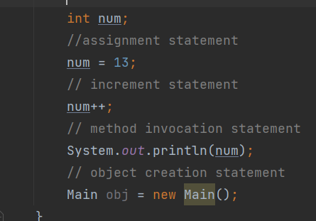

# Java Basics

## Variables

The Java programming languge defines different type of variables:

- **Instance Variables (Non-Static Fields):** declared without the  ```static```
 keyword.

- **Class Variables (Static Fields):** A class variable is any field declared with the ```static``` modifier.

- **Local Variables:**  method will often store its temporary state in local variables.

- **Parameters:**

```JAVA
public static void main(String[] args)
```


## Operators


## Expressions, Statements, and Blocks

**Expressions:** it's a way of declared variables, operators, and method invocations

Example

 

**Statements:**
 Such statements are called expression statements.

Example

 

**Blocks:**

Example

 

## Control Flow Statements

its type of statement that using for looping or condition.