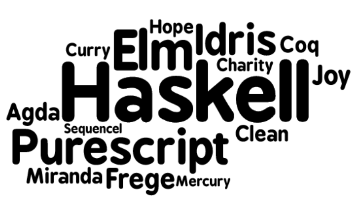
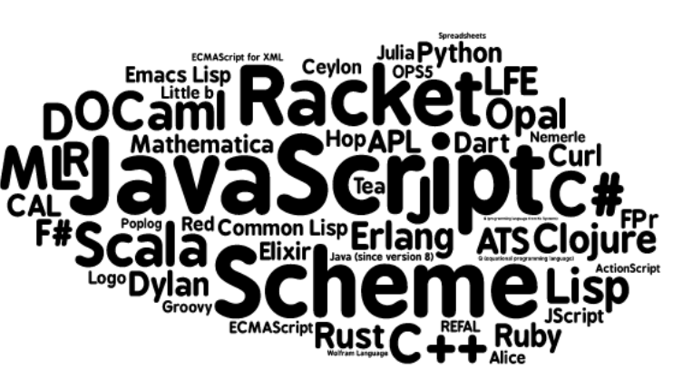

# Purely functional programming

Purely functional programming consists of ensuring that functions will only depend on their arguments.

Functional programming as used generally by us as an industry tends to mean using first-class functions, closures that capture their environment properly, immutable data structures, trying to write code that doesn't have side-effects,

but it's distince from pure functional programming, pure functional mean it has only functions

## side effects

These are some things you can do in source code:

1. Mutate variables.
2. Make side-effects (writing to standard output, connecting to a socket, etc.)
3. Get the current time.

These are all things you cannot do in a pure function, because they're not explicit inputs into or explicit outputs of the function.

these are side-effects that pure code can cause:

1. Allocate lots of memory.
2. Take lots of time.
3. Loop forever.

## Properties of purely functional programming

### Strict versus non-strict evaluation

Each evaluation strategy which ends on a purely functional program returns the same result.

### Parallel computing

Purely functional programming simplifies parallel computing (is a type of computation in which many calculations or processes are carried out simultaneously.) since two purely functional parts of the evaluation never interact.

### Data structures

Purely functional data structures are often represented in a different way than their imperative counterparts.

In general, conversion of an imperative program to a purely functional one also requires ensuring that the formerly-mutable structures are now explicitly returned from functions that update them, a program structure called store-passing style.

## Which languages are purely functional

**Pure languages**

**Impure languages**

