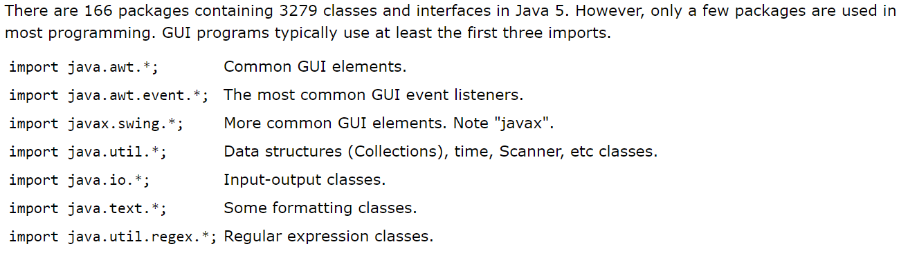

# Arrays, Loops, Imports

## Packages and Import

**Package = directory.** pajages is a group of classes,A package name is the same as the directory (folder) name which contains the .java files.

### Package declaration

it must be the first statement.
you can use **import statement** to specify classes from pakages

### Package declaration syntax

```JAVA
// This source file must be Drawing.java in the illustration directory.

package illustration;

import java.awt.*;

public class Drawing {
    . . .
}
```

### Imports: three options

```JAVA
import javax.swing.*;  // Make all classes visible altho only one is used.

class ImportTest {
    public static void main(String[] args) {
        JOptionPane.showMessageDialog(null, "Hi");
        System.exit(0);
    }
}
```

- Classes can be specified explicitly on import instead of using the wildcard character.

```JAVA
  import javax.swing.JOptionPane;  // Make a single class visible.

class ImportTest {
    public static void main(String[] args) {
        JOptionPane.showMessageDialog(null, "Hi");
        System.exit(0);
    }
}
```

### Common imports



## Loops

ther are many types of looping statement

1. Simple for loop

    ```JAVA
    public class ForExample {  
        public static void main(String[] args) {    
            for(int i=1;i<=10;i++){  
            System.out.println(i);  
            }  
        }  
    }
    ```

2. Enhanced for-each loop

    ```JAVA
       class Main {
        public static void main(String[] args) {
            // create an array
            int[] numbers = {3, 9, 5, -5};
            // for each loop 
            for (int number: numbers) {
                System.out.println(number);
            }
        }
    }
    ```

3. While loop

     ```JAVA
    public class WhileExample {
        public static void main(String[] args) {  
            int i=1;

            while(i<=10){  
                System.out.println(i);  
                i++;  
            }  
        }  
    } 
    ```

4. Do-While loop

     ```JAVA
    public class DoWhileExample {    
        public static void main(String[] args) {    
            int i=1;    
            do{    
                System.out.println(i);    
                i++;    
            }while(i<=10);    
        }    
    }
    ```
