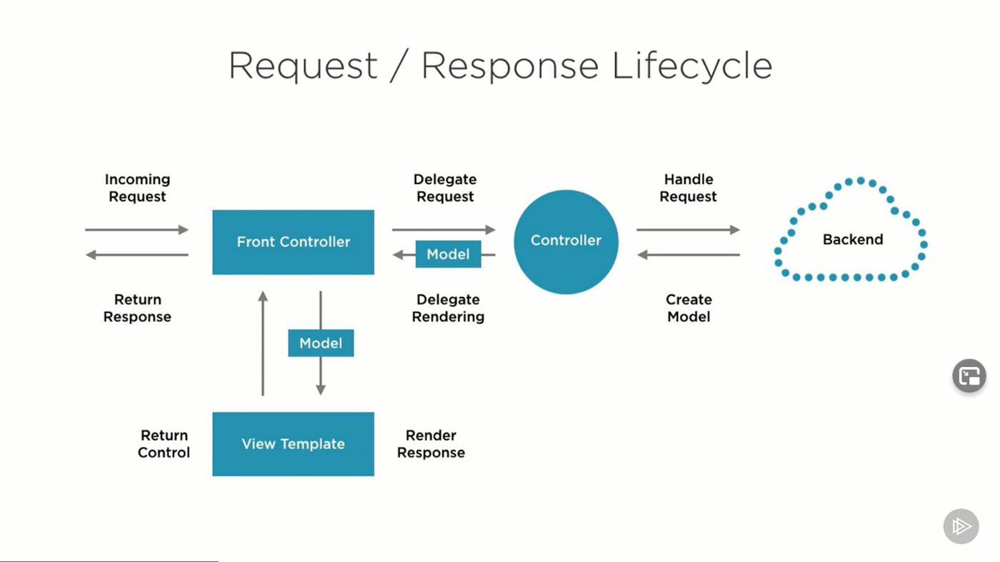

# Spring MVC

Spring MVC is a java frameork which is uesd to build web application.



- **Model** - A model contains the data of the application. A data can be a single object or a collection of objects.

- **Controller** - A controller contains the business logic of an application. Here, the @Controller annotation is used to mark the class as the controller.

- **View** - A view represents the provided information in a particular format. Generally, JSP+JSTL is used to create a view page. Although spring also supports other view technologies such as Apache Velocity, Thymeleaf and FreeMarker.

- **Front Controller** - In Spring Web MVC, the DispatcherServlet class works as the front controller. It is responsible to manage the flow of the Spring MVC application.

## Advantages of Spring MVC Framework

- **Separate roles** - The Spring MVC separates each role, where the model object, controller, command object, view resolver, DispatcherServlet, validator, etc. can be fulfilled by a specialized object.
- **Light-weight** - It uses light-weight servlet container to develop and deploy your application.
- **Powerful Configuration** - It provides a robust configuration for both framework and application classes that includes easy referencing across contexts, such as from web controllers to business objects and validators.
- **Rapid development** - The Spring MVC facilitates fast and parallel development.
- **Reusable business code** - Instead of creating new objects, it allows us to use the existing business objects.
- **Easy to test** - In Spring, generally we create JavaBeans classes that enable you to inject test data using the setter methods.
- **Flexible Mapping** - It provides the specific annotations that easily redirect the page.

## Create a Web Controller

```java
    package com.example.servingwebcontent;

    import org.springframework.stereotype.Controller;
    import org.springframework.ui.Model;
    import org.springframework.web.bind.annotation.GetMapping;
    import org.springframework.web.bind.annotation.RequestParam;

    @Controller
    public class GreetingController {

        @GetMapping("/greeting")
        public String greeting(@RequestParam(name="name", required=false, defaultValue="World") String name, Model model) {
            model.addAttribute("name", name);
            return "greeting";
        }
    }
```

## Spring MVC and Thymeleaf: how to access data from templates

1. **Spring model attributes**

    Add attribute to **Model** via its **addAttribute** method:

    ```java
    @RequestMapping(value = "message", method = RequestMethod.GET)
        public String messages(Model model) {
            model.addAttribute("messages", messageRepository.findAll());
            return "message/list";
        }
    ```

    Return **ModelAndView** with model attributes included:

    ```java
    @RequestMapping(value = "message", method = RequestMethod.GET)
        public ModelAndView messages() {
            ModelAndView mav = new ModelAndView("message/list");
            mav.addObject("messages", messageRepository.findAll());
            return mav;
        }
    ```

    Expose common attributes via methods annotated with **@ModelAttribute**:

    ```java
    @ModelAttribute("messages")
        public List<Message> messages() {
            return messageRepository.findAll();
        }
    ```

    You can access model attributes in views with Thymeleaf as follows:

    ```html
    <tr th:each="message : ${messages}">
            <td th:text="${message.id}">1</td>
            <td><a href="#" th:text="${message.title}">Title ...</a></td>
            <td th:text="${message.text}">Text ...</td>
        </tr>
    ```

2. **Request parameters**
    Request parameters can be easily accessed in Thymeleaf views. Request parameters are passed from the client to server like:

    ```java
     https://example.com/query?q=Thymeleaf+Is+Great!
     ```

    Let’s assume we have a **@Controller** that sends a redirect with a request parameter:

    ```java
    @Controller
        public class SomeController {
            @RequestMapping("/")
            public String redirect() {
                return "redirect:/query?q=Thymeleaf+Is+Great!";
            }
        }
    ```

    In order to access the **q** parameter you can use the **param**. prefix:

    ```html
     <p th:text="${param.q}">Test</p>
    ```

    Since parameters can be multivalued you may access them using brackets syntax:

      ```html
     <p th:text="${param.q[0] + ' ' + param.q[1]}" th:unless="${param.q == null}">Test</p>
    ```

    Another way to access request parameters is by using the special **#request** object that gives you direct access to the **javax.servlet.http.HttpServletRequest** object:

      ```html
     <p th:text="${#request.getParameter('q')}" th:unless="${#request.getParameter('q') == null}">Test</p>
    ```

3. **Session attributes**

    ```java
     @RequestMapping({"/"})
        String index(HttpSession session) {
            session.setAttribute("mySessionAttribute", "someValue");
            return "index";
        }
    ```

    Similarly to the request parameters, session attributes can be accessed by using the **session**. prefix:

      ```html
    <p th:text="${session.mySessionAttribute}" th:unless="${session == null}">[...]</p>
    ```

    Or by using **#session**, that gives you direct access to the **javax.servlet.http.HttpSession** object: **${#session.getAttribute('mySessionAttribute')}**

4. **ServletContext attributes**

    ```html
         <table>
            <tr>
                <td>My context attribute</td>
                    <!-- Retrieves the ServletContext attribute 'myContextAttribute' -->
                    <td th:text="${#servletContext.getAttribute('myContextAttribute')}">42</td>
                </tr>
                <tr th:each="attr : ${#servletContext.getAttributeNames()}">
                    <td th:text="${attr}">javax.servlet.context.tempdir</td>
                    <td th:text="${#servletContext.getAttribute(attr)}">/tmp</td>
                </tr>
        </table>
    ```

5. **Spring beans**
    Thymeleaf allows accessing beans registered at the Spring Application Context with the **@beanName** syntax, for example:

    ```html
    <div th:text="${@urlService.getApplicationUrl()}">...</div> 
    ```

    In the above example, **@urlService** refers to a Spring Bean registered at your context, e.g.

    ```java
    @Configuration
        public class MyConfiguration {
            @Bean(name = "urlService")
            public UrlService urlService() {
                return () -> "domain.com/myapp";
            }
        }

        public interface UrlService {
            String getApplicationUrl();
        }
    ```