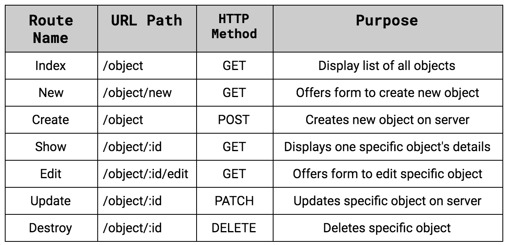

# Spring RESTful Routing & Static Files

## What is REST?

**REST** stands for Representational State Transfer.

**RESTful Routing:** is a set of standards used in many different languages to create efficient, reusable routes. It aims to map HTTP methods (GET, POST, PATCH, DELETE) and CRUD actions (Create, Read, Update, Destroy) together in a conventional pattern

## REST Conventions



- **Route Name** refers to the name of the route method in the controller.

- **URL Path** refers to the path listed above the route in a route decorator. This will also be the URL a user sees when navigating to this area of the site.

- **HTTP Method** refers to the HTTP method that route will respond to, or be invoked for.

- **Purpose** details what each route is responsible for.

## Accessing Data with JPA

### Define a Simple Entity

```Java
package com.example.accessingdatajpa;

import javax.persistence.Entity;
import javax.persistence.GeneratedValue;
import javax.persistence.GenerationType;
import javax.persistence.Id;

@Entity
public class Customer {

  @Id
  @GeneratedValue(strategy=GenerationType.AUTO)
  private Long id;
  private String firstName;
  private String lastName;

  protected Customer() {}

  public Customer(String firstName, String lastName) {
    this.firstName = firstName;
    this.lastName = lastName;
  }

  @Override
  public String toString() {
    return String.format(
        "Customer[id=%d, firstName='%s', lastName='%s']",
        id, firstName, lastName);
  }

  public Long getId() {
    return id;
  }

  public String getFirstName() {
    return firstName;
  }

  public String getLastName() {
    return lastName;
  }
}
```

### Create Simple Queries

Spring Data JPA focuses on using JPA to store data in a relational database.

```java
package com.example.accessingdatajpa;

import java.util.List;

import org.springframework.data.repository.CrudRepository;

public interface CustomerRepository extends CrudRepository<Customer, Long> {

  List<Customer> findByLastName(String lastName);

  Customer findById(long id);
}
```

### Create an Application Class

Spring Initializr creates a simple class for the application.

```java
package com.example.accessingdatajpa;

import org.springframework.boot.SpringApplication;
import org.springframework.boot.autoconfigure.SpringBootApplication;

@SpringBootApplication
public class AccessingDataJpaApplication {

  public static void main(String[] args) {
    SpringApplication.run(AccessingDataJpaApplication.class, args);
  }

}
```

**@SpringBootApplication** is a convenience annotation that adds all of the following:

- **@Configuration:** Tags the class as a source of bean definitions for the application context.

- **@EnableAutoConfiguration:** Tells Spring Boot to start adding beans based on classpath settings, other beans, and various property settings. For example, if spring-webmvc is on the classpath, this annotation flags the application as a web application and activates key behaviors, such as setting up a DispatcherServlet.

- **@ComponentScan:** Tells Spring to look for other components, configurations, and services in the com/example package, letting it find the controllers.

```java
package com.example.accessingdatajpa;

import org.slf4j.Logger;
import org.slf4j.LoggerFactory;
import org.springframework.boot.CommandLineRunner;
import org.springframework.boot.SpringApplication;
import org.springframework.boot.autoconfigure.SpringBootApplication;
import org.springframework.context.annotation.Bean;

@SpringBootApplication
public class AccessingDataJpaApplication {

  private static final Logger log = LoggerFactory.getLogger(AccessingDataJpaApplication.class);

  public static void main(String[] args) {
    SpringApplication.run(AccessingDataJpaApplication.class);
  }

  @Bean
  public CommandLineRunner demo(CustomerRepository repository) {
    return (args) -> {
      // save a few customers
      repository.save(new Customer("Jack", "Bauer"));
      repository.save(new Customer("Chloe", "O'Brian"));
      repository.save(new Customer("Kim", "Bauer"));
      repository.save(new Customer("David", "Palmer"));
      repository.save(new Customer("Michelle", "Dessler"));

      // fetch all customers
      log.info("Customers found with findAll():");
      log.info("-------------------------------");
      for (Customer customer : repository.findAll()) {
        log.info(customer.toString());
      }
      log.info("");

      // fetch an individual customer by ID
      Customer customer = repository.findById(1L);
      log.info("Customer found with findById(1L):");
      log.info("--------------------------------");
      log.info(customer.toString());
      log.info("");

      // fetch customers by last name
      log.info("Customer found with findByLastName('Bauer'):");
      log.info("--------------------------------------------");
      repository.findByLastName("Bauer").forEach(bauer -> {
        log.info(bauer.toString());
      });
      // for (Customer bauer : repository.findByLastName("Bauer")) {
      //  log.info(bauer.toString());
      // }
      log.info("");
    };
  }

}
```

## Baeldung: Comparing repositories

### 1. Spring Data Repositories

simple Product entity

```java
Entity
public class Product {

    @Id
    private long id;
    private String name;

    // getters 
```

find a Product based on its name:

```java
@Repository
public interface ProductRepository extends JpaRepository<Product, Long> {
    Product findByName(String productName);
}
```

### 2. CrudRepository

```java
public interface CrudRepository<T, ID extends Serializable>
  extends Repository<T, ID> {

    <S extends T> S save(S entity);

    T findOne(ID primaryKey);

    Iterable<T> findAll();

    Long count();

    void delete(T entity);

    boolean exists(ID primaryKey);
}
```

- save(…) – save an Iterable of entities. Here, we can pass multiple objects to save them in a batch

- findOne(…) – get a single entity based on passed primary key value

- findAll() – get an Iterable of all available entities in database

- count() – return the count of total entities in a table

- delete(…) – delete an entity based on the passed object

- exists(…) – verify if an entity exists based on the passed primary key value

### 3. PagingAndSortingRepository

```java
public interface PagingAndSortingRepository<T, ID extends Serializable> 
  extends CrudRepository<T, ID> {

    Iterable<T> findAll(Sort sort);

    Page<T> findAll(Pageable pageable);
}
```

When using Pageable, we create a Pageable object with certain properties and we've to specify at least:

1. Page size
2. Current page number
3. Sorting

```java
Sort sort = new Sort(new Sort.Order(Direction.ASC, "lastName"));
Pageable pageable = new PageRequest(0, 5, sort);
```

### 4. JpaRepository

```java
public interface JpaRepository<T, ID extends Serializable> extends
  PagingAndSortingRepository<T, ID> {

    List<T> findAll();

    List<T> findAll(Sort sort);

    List<T> save(Iterable<? extends T> entities);

    void flush();

    T saveAndFlush(T entity);

    void deleteInBatch(Iterable<T> entities);
}
