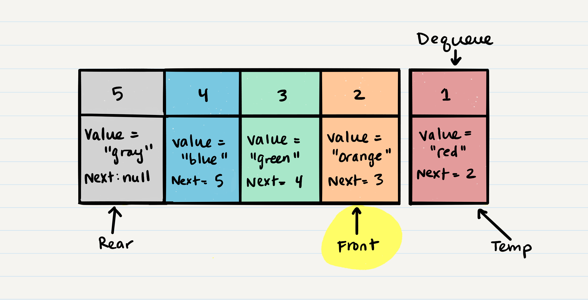

# Stacks and Queues

## What is a Stak

A data structure that consists of **Nodes** Each **Node** references the next Node in the stack, but does not reference its previous.

Common terminology for a stack is

    1. Push - Nodes or items that are put into the stack are pushed
    2. Pop - Nodes or items that are removed from the stack are popped. When you attempt to pop an empty stack an exception will be raised.
    3. Top - This is the top of the stack.
    4. Peek - When you peek you will view the value of the top Node in the stack. When you attempt to peek an empty stack an exception will be raised.
    5. IsEmpty - returns true when stack is empty otherwise returns false.

Stacks follow these concepts:

    **FILO:** First In Last Out

    **LIFO:** Last In First Out

**Stack Visualization:**

The topmost item called the **top** and when we push a new item to the stack it becomes the new **top** and when we pop something from the stack we pop the current **top** nd set the next **top** as **top.next**


**Push O(1)** the pushing takes the same amount of time so its always O(1)

the steps for push

1. First, you should have the Node that you want to add.
    

2. Next, you need to assign the next property of Node 5 to reference the same Node that top is referencing: Node 4
    
3. your new Node is added to your stack, but there is no indication that it is the first Node in the stack. To make this happen, you have to re-assign our reference top to the newly added Node, Node 5
    

```JAVA
    ALOGORITHM push(value)
    // INPUT <-- value to add, wrapped in Node internally
    // OUTPUT <-- none
   node = new Node(value)
   node.next <-- Top
   top <-- Node
```

**Pop O(1)** is the action of removing a Node form the top.

 

 to Pop off Node 5 we need to follow these steps

1. The first step of removing Node 5 from the stack is to create a reference named temp that points to the same Node that top points to.
    

2. Once you have created the new reference type, you now need to re-assign top to the value that the next property is referencing. In our visual, we can see that the next property is pointing to Node 4. We will re-assign top to be Node 4.
    

3. We can now remove Node 5 safely without it affecting the rest of the stack. Before we do that though you may want to make sure that you clear out the next property in your current temp reference. This will ensure that no further references to Node 4 are floating around the heap. This will allow our garbage collector to cleanly and safely dispose of the Nodes correctly.
    

4. Finally, we return the value of the temp Node that was just popped off.

```JAVA
    ALGORITHM pop()
    // INPUT <-- No input
    // OUTPUT <-- value of top Node in stack
    // EXCEPTION if stack is empty

   Node temp <-- top
   top <-- top.next
   temp.next <-- null
   return temp.value
```

**Peek O(1):**
```JAVA
    ALGORITHM peek()
    // INPUT <-- none
    // OUTPUT <-- value of top Node in stack
    // EXCEPTION if stack is empty

   return top.value
```

**IsEmpty O(1):**
```JAVA
    ALGORITHM isEmpty()
    // INPUT <-- none
    // OUTPUT <-- boolean

    return top = NULL
```

## What is a Queue

**Common terminology for a queue is:**

    1. Enqueue - Nodes or items that are added to the queue.
    2. Dequeue - Nodes or items that are removed from the queue. If called when the queue is empty an exception will be raised.
    3. Front - This is the front/first Node of the queue.
    4. Rear - This is the rear/last Node of the queue.
    5. Peek - When you peek you will view the value of the front Node in the queue. If called when the queue is empty an exception will be raised.
    6. IsEmpty - returns true when queue is empty otherwise returns false.

### Queue Visualization


### Enqueue O(1)

its done with ad **O(1)** because it doesn't matter how many items live in the queue.

the steps og adding a Node to a queue:


1. First, we should change the next property of Node 4 to point to the Node we are adding. In our case with the visual below, we will be re-assigning Node 4’s .next to Node 5. The only way we have access to Node 4 is through our reference rear. Following the rules of reference types, this means that we must change rear.next to Node 5.

    

2. After we have set the next property, we can re-assign the rear reference to point to Node 5. By doing this, it allows us to keep a reference of where the rear is, and we can continue to enqueue Nodes into the queue as needed.

    

3. Congratulations! You have just successfully added a Node to a queue by activating the enqueue action.

```JAVA
    ALGORITHM enqueue(value)
    // INPUT <-- value to add to queue (will be wrapped in Node internally)
    // OUTPUT <-- none
   node = new Node(value)
   rear.next <-- node
   rear <-- node
```

### Dequeue O(1)

its done with ad **O(1)** because it doesn't matter how many items live in the queue.

the steps of removing a Node to a queue:

1. The first thing you want to do is create a temporary reference type named temp and have it point to the same Node that front is pointing too. This means that temp will point to Node 1.
 
2. Next, you want to re-assign front to the next value that the Node front is referencing. In our visual, this would be Node 2.
    
3. Now that we have moved front to the second Node in line, we can next re-assign the next property on the temp Node to null. We do this because we want to make sure that all the proper Nodes clear any unnecessary references for the garbage collector to come in later and clean up.
    
4.Finally, we return the value of the temp Node that was just removed.

```JAVA
  ALGORITHM dequeue()
// INPUT <-- none
// OUTPUT <-- value of the removed Node
// EXCEPTION if queue is empty

   Node temp <-- front
   front <-- front.next
   temp.next <-- null

   return temp.value
```

### Peek O(1)

When conducting a peek, you will only be inspecting the front Node of the queue.

```JAVA
 ALGORITHM peek()
// INPUT <-- none
// OUTPUT <-- value of the front Node in Queue
// EXCEPTION if Queue is empty

   return front.value
```

### IsEmpty O(1)

```JAVA
ALGORITHM isEmpty()
// INPUT <-- none
// OUTPUT <-- boolean

return front = NULL
```