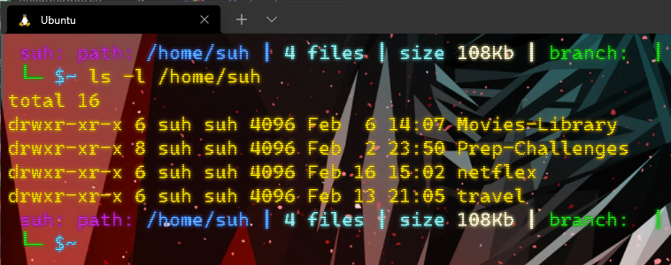
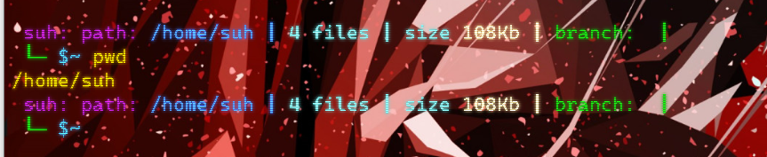
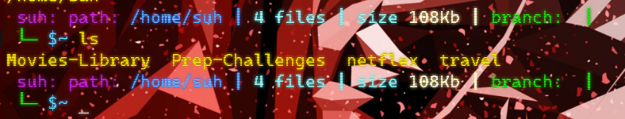
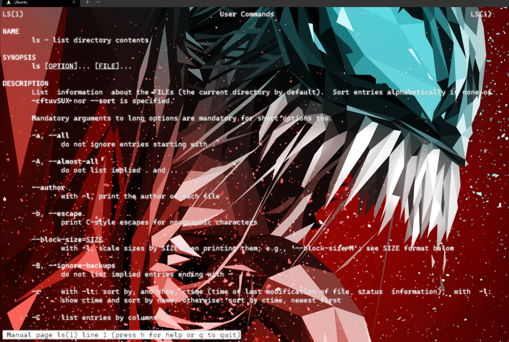
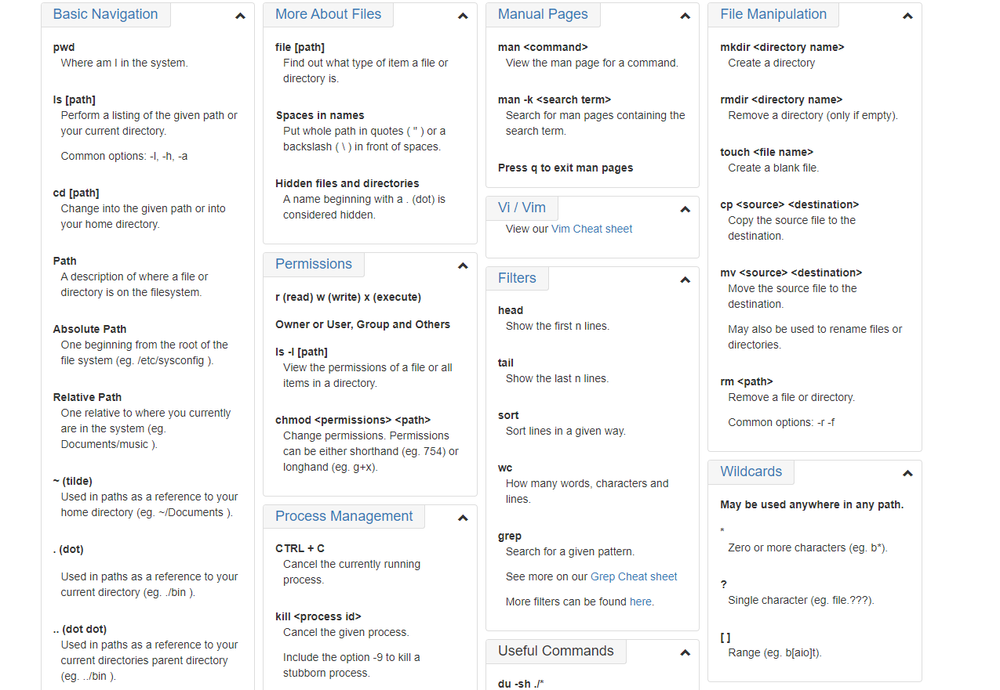
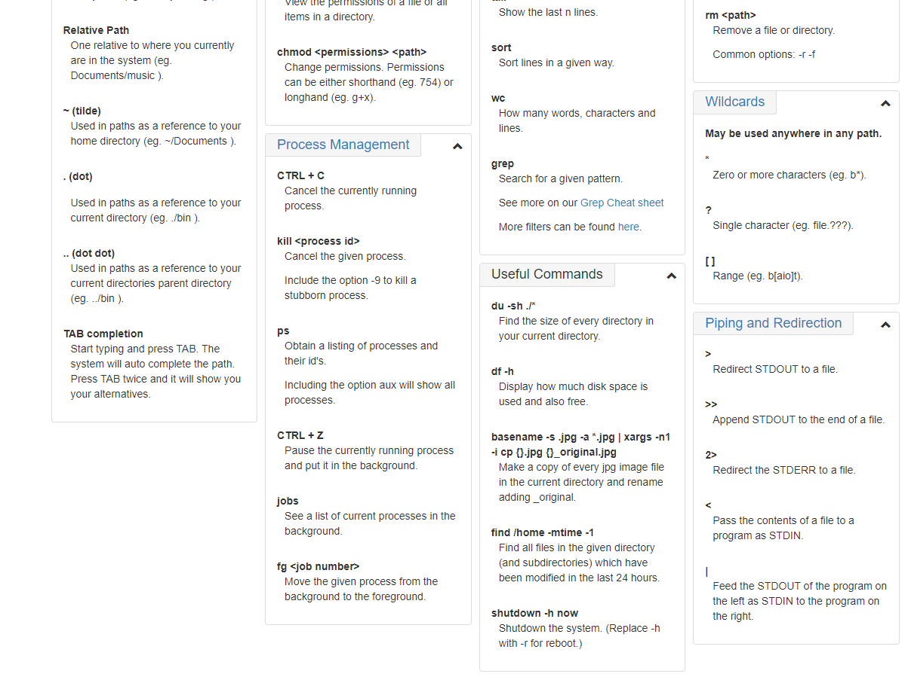

# Terminal Practice

## the command line
**what are they exactly**

A command line is a text based interface to the system. You are able to enter commands by typing them on the keyboard and feedback will be given to you similarly as text.

## Navigation
 **where are we?**

 PWD:The command does just that. It tells you what your current or present working directory is. Give it a try now

**What's in Owr Current Location?**

ls : this command show us what in the current location.

## More About File
we have a commands that give us an info of the files.

file: obtain information about what type of file a file or directory is.

ls -a: List the contents of a directory, including hidden files.

## Manual Pages

## File Manipulation
 
 mkdir: used to make new folder

 rmdir : used to remove a folder

 touch : to make a file

 cp : used to make a duplicate of a file or directory

 mv :to move a file

 rm -r :Removing a File (and non empty Directories)
 
 
 