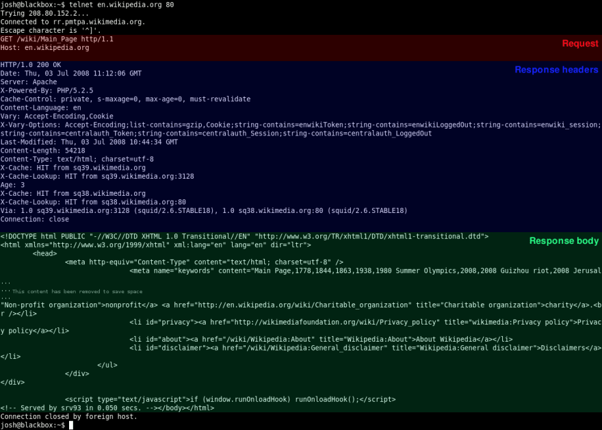

# WRRC in Java

## The HTTP request lifecycle

### Step 1: Local Processing

This step depending on the application making the request,(for example request is being maede by a browser)

1. the browser extracts the "scheme"/protocol, host (www.example.com), and optional port number, resource path, and query strings that are specified in the form.

    **Example:**
        ```
        <protocol>://<host><:optional port>/<path/to/resource><?query>.
        |http|://|www.example.com||:5000||/mainpage||?query=param&query2=param2
        ```
        

2. Now that the browser has the intended hostname for the request, it needs to resolve an IP address1.

### Step 2: Resolve an IP

To resolve an IP from a DNS server it takes many steps.

1. If the cache lookup fails, the browser fires off a DNS request using UDP, The UDP is a lightweight protocol.
    

2. Whenever the packet hits a piece of networking equipment, the device uses a routing table to determine which other device it is connected to that is most likely situated along the shortest path to the destination.

3. The server looks for the address associated with the requested hostname. If it finds one, it sends a response.

4. The requesting client now has a target IP. It will also have received a piece of information as part of the answer that will let it know how long the returned answer can be cached for.

### Step 3: Establish a TCP Connection

Whene the client has an IP address, it can send an HTTP request, but first, the client must open a TCP connection.

1. One of the key differences between TCP and UDP is that TCP ensures delivery and ordered data transmission.

2. The TCP connections are opened using what’s known as a three-way handshake.

    1. he client initiates the active open by sending a SYN7 "control"8 packet to the server. The client sets the sequence number for the first packet to a random value purposely, in service of security. We’ll refer to this number as x for now.

    2. The server responds with a SYN-ACK9 message, which contains an acknowledgement number for the original message that is always x+1, and a new sequence number for the response itself, which is another random number y.

    3. In the third step, the client sends an ACK10 message back to the server with a sequence number equal to x+1, which should match the SYN-ACK message’s acknowledgment number and ensure that our data is being delivered reliably. The ACK message’s acknowledgment number (since it is acknowledging the SYN-ACK) is set to one more than the received sequence number, or y+1.

3. The connection has also established a random, sequential sequence11 for each direction of communication (client->server, server->client), allowing for bidirectional, concurrent communication along the connection, which is also known as full duplex communication.

### Step 4: Send an HTTP Request

Now the client has an IP address and a TCP connection we can send a request now.

1. The request is made up of a "request line", request header, and a body.
    

2. Once the HTTP request is sent, with the difference being that using TCPs magic sequence number powers, the server can ensure it receives the whole request, in the correct order.

3. Once the server receives the request, processes it, and finds the resource being requested, it generates an HTTP response. An HTTP response has a similar structure to an HTTP request, containing a "status line", response header fields, and an optional body. The status line contains an HTTP status code indicating the success, failure, or error-state of the request along with a "reason message" that provides detail.

4. Once the response is generated, the server responds to the request. At the TCP layer, the client receives the first data packet, the first byte of which should contain the HTTP response header. More packets start coming in, and at the TCP layer they are re-ordered as needed. For every two packets that the client receives at the TCP layer, it sends an ACK message to the server. This goes on until the response is (hopefully) fully loaded.

### Step 5: Tearing Down and Cleaning Up

1. The client sends a FIN packet at the TCP level, to which the server responds with an ACK, and then generally sends a FIN of its own, which the client responds to with its own ACK signal. The client then waits for a brief timeout, during which it cannot accept new connections, to prevent delayed packets from previous connections arriving during subsequent activities on the port. This four way handshake12 signals the end of the TCP connection.

2. At this point, your browser begins processing what it has received.

## Java HTTP Request example

1. **Creating a Request**
    The HttpUrlConnection class allows us to perform basic HTTP requests

    All the classes that we need are part of the

    ```Java
     java.net package.
     ```

2. **Creating a Request**
    We can create an HttpUrlConnection instance using the openConnection() method of the URL class

    ```JAVA
    URL url = new URL("http://example.com");
    HttpURLConnection con = (HttpURLConnection) url.openConnection();
    con.setRequestMethod("GET");
    ```

3. **Adding Request Parameters**
    If we want to add parameters to a request, we have to set the doOutput property to true, then write a String of the form param1=value¶m2=value to the OutputStream of the HttpUrlConnection instance:

    ```JAVA
    Map<String, String> parameters = new HashMap<>();
    parameters.put("param1", "val");

    con.setDoOutput(true);
    DataOutputStream out = new DataOutputStream(con.getOutputStream());
    out.writeBytes(ParameterStringBuilder.getParamsString(parameters));
    out.flush();
    out.close();
    ```

    ```JAVA
    public class ParameterStringBuilder {
        public static String getParamsString(Map<String, String> params) 
        throws UnsupportedEncodingException{
            StringBuilder result = new StringBuilder();

            for (Map.Entry<String, String> entry : params.entrySet()) {
            result.append(URLEncoder.encode(entry.getKey(), "UTF-8"));
            result.append("=");
            result.append(URLEncoder.encode(entry.getValue(), "UTF-8"));
            result.append("&");
            }

            String resultString = result.toString();
            return resultString.length() > 0
            ? resultString.substring(0, resultString.length() - 1)
            : resultString;
        }
    }
    ```

4. **Setting Request Headers**
    Adding headers to a request can be achieved by using the setRequestProperty() method:

    ```Java
    con.setRequestProperty("Content-Type", "application/json");
    ```

    To read the value of a header from a connection, we can use the getHeaderField() method:

    ```Java
    String contentType = con.getHeaderField("Content-Type");
    ```

5. **Configuring Timeouts**
    To set the timeout values, we can use the setConnectTimeout() and setReadTimeout() methods:

    ```Java
    con.setConnectTimeout(5000);
    con.setReadTimeout(5000);
    ```

6. **Handling Cookies**
    to read the cookies from a response:

     ```Java
    String cookiesHeader = con.getHeaderField("Set-Cookie");
    List<HttpCookie> cookies = HttpCookie.parse(cookiesHeader);
    ```

    add the cookies to the cookie store:

     ```Java
    cookies.forEach(cookie -> cookieManager.getCookieStore().add(null, cookie));
    ```

    Let's check if a cookie called username is present, and if not, we will add it to the cookie store with a value of “john”:

    ```Java
     Optional<HttpCookie> usernameCookie = cookies.stream()
        .findAny().filter(cookie -> cookie.getName().equals("username"));
    if (usernameCookie == null) {
        cookieManager.getCookieStore().add(null, new HttpCookie("username", "john"));
    }
    ```

    add the cookies to the request:

     ```Java
     con.disconnect();
        con = (HttpURLConnection) url.openConnection();

    con.setRequestProperty("Cookie", 
        StringUtils.join(cookieManager.getCookieStore().getCookies(), ";"));
    ```

7. **Handling Redirects**
    enable or disable automatically following redirects for a specific connection:

    ```java
        con.setInstanceFollowRedirects(false);
    ```

     enable or disable automatic redirect for all connections:

     ```java
     HttpUrlConnection.setFollowRedirects(false);
     ```

    ```java
     if (status == HttpURLConnection.HTTP_MOVED_TEMP
        || status == HttpURLConnection.HTTP_MOVED_PERM) {
        String location = con.getHeaderField("Location");
        URL newUrl = new URL(location);
        con = (HttpURLConnection) newUrl.openConnection();
    }
     ```

8. **Reading the Response**
    To execute the request, we can use the getResponseCode(), connect(), getInputStream() or getOutputStream() methods:

    ```java
    int status = con.getResponseCode();
    ```

    Finally, let's read the response of the request and place it in a content String:

    ```java
    BufferedReader in = new BufferedReader(
        new InputStreamReader(con.getInputStream()));
    String inputLine;
    StringBuffer content = new StringBuffer();
    while ((inputLine = in.readLine()) != null) {
        content.append(inputLine);
    }
    in.close()
    ```

    To close the connection, we can use the disconnect() method:

    ```java
    con.disconnect();
    ```

9. **Reading the Response on Failed Requests**
    we can consume the stream provided by HttpUrlConnection.getErrorStream().

    ```java
     int status = con.getResponseCode();

    Reader streamReader = null;

    if (status > 299) {
        streamReader = new InputStreamReader(con.getErrorStream());
    } else {
        streamReader = new InputStreamReader(con.getInputStream());
    }
     ```

10. **Building the Full Response**
    we can build it using some of the methods that the HttpUrlConnection instance offers:

    ```java
     public class FullResponseBuilder {
        public static String getFullResponse(HttpURLConnection con) throws IOException {
            StringBuilder fullResponseBuilder = new StringBuilder();

        // read status and message

        // read headers

        // read response content

        return fullResponseBuilder.toString();
        }
    }
     ```

     First, let's add the response status information:

      ```java
      fullResponseBuilder.append(con.getResponseCode())
        .append(" ")
        .append(con.getResponseMessage())
        .append("\n");
     ```

     Next, we'll get the headers using getHeaderFields():

      ```java
      con.getHeaderFields().entrySet().stream()
        .filter(entry -> entry.getKey() != null)
        .forEach(entry -> {
            fullResponseBuilder.append(entry.getKey()).append(": ");
            List headerValues = entry.getValue();
            Iterator it = headerValues.iterator();
            if (it.hasNext()) {
                fullResponseBuilder.append(it.next());
                while (it.hasNext()) {
              fullResponseBuilder.append(", ").append(it.next());
          }
      }
      fullResponseBuilder.append("\n");
    });
     ```

    **Finally, we'll read the response content**