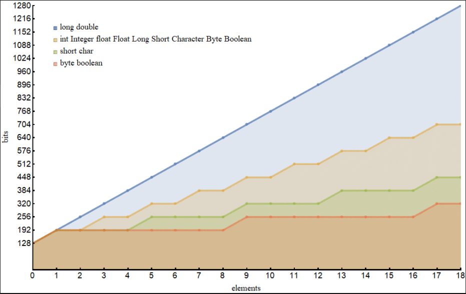
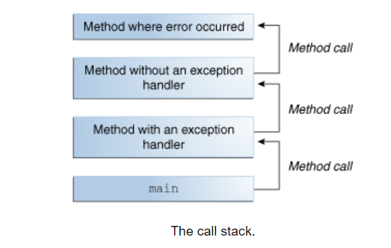
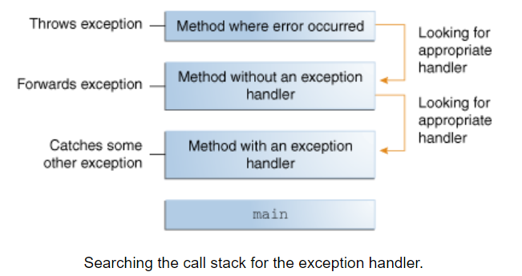
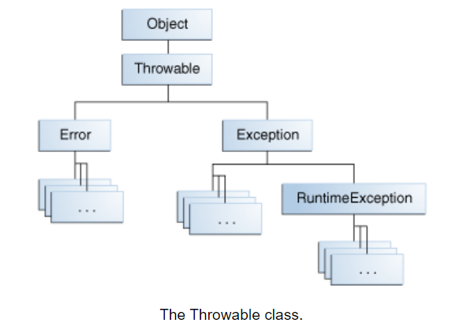

# Maps, primitives, File I/O

## Java Primitives versus Objects

**Java has two fold type:**

1. system consisting of primitives such as int, boolean
2. reference types such as Integer, Boolean.

**Pros and cons:**

to know what object we gonna use we have to know first the available memory, available amount of memory and the the default values.

1. Single Item Memory Footprint
    - boolean – 1 bit
    - byte – 8 bits
    - short, char – 16 bits
    - int, float – 32 bits
    - long, double – 64 bits

2. Memory Footprint for Arrays
    

    - long, double: m(s) = 128 + 64 s
    - short, char: m(s) = 128 + 64 [s/4]
    - byte, boolean: m(s) = 128 + 64 [s/8]
    - the rest: m(s) = 128 + 64 [s/2]

    We can see either that single-element arrays of primitive types are almost always more expensive (except for long and double) than the corresponding reference type.

3. Performance
    the performance of a Java depends very much on the hardware on which the code runs

4. Default Values
    Default values of the primitive types are 0 for numeric types, false for the boolean type, \u0000 for the char type. For the wrapper classes, the default value is null.

## Exceptions

### What Is an Exception?

**Definition:** An exception is an event, which occurs during the execution of a program, that disrupts the normal flow of the program's instructions.

After a method throws an exception, the runtime system attempts to find something to handle it. The set of possible "somethings" to handle the exception is the ordered list of methods that had been called to get to the method where the error occurred. The list of methods is known as **the call stack**.



the call stack method contains a block of code that can handle the exception and its called **excpion handler**

The exception handler chosen is said to **catch the exception**. If the runtime system exhaustively searches all the methods on the call stack without finding an appropriate exception handler, as shown in the next figure, the runtime system terminates.



### The Catch or Specify Requirement

the code that might throw certain exceptions must be enclosed by either of the following:

- A ```try``` statement that catches the exception
- statement that catches the exception

**The Three Kinds of Exceptions:**

1. **checked exception:** These are exceptional conditions that a well-written application should anticipate and recover from, Checked exceptions are subject to the Catch or Specify Requirement. All exceptions are checked exceptions, except for those indicated by ```Error, RuntimeException,``` and their subclasses.

2. **error:** These are exceptional conditions that are external to the application, and that the application usually cannot anticipate or recover from,These are exceptional conditions that are external to the application, and that the application usually cannot anticipate or recover from

3. **runtime exception:** These are exceptional conditions that are internal to the application, and that the application usually cannot anticipate or recover from, Runtime exceptions are not subject to the Catch or Specify Requirement. Runtime exceptions are those indicated by ```RuntimeException``` and its subclasses

### How to Throw Exceptions

any code can theow an excption,package written by someone else always thrown with the ```throw``` statement.

**The throw Statment:** 

```Java
public Object pop() {
    Object obj;

    if (size == 0) {
        throw new EmptyStackException();
    }

    obj = objectAt(size - 1);
    setObjectAt(size - 1, null);
    size--;
    return obj;
}
```

**Throwable Class and Its Subclasses:**



## Scanning

Objects of type Scanner are useful for breaking down formatted input into tokens and translating individual tokens according to their data type.

### Breaking Input into Tokens

```Java
import java.io.*;
import java.util.Scanner;

public class ScanXan {
    public static void main(String[] args) throws IOException {

        Scanner s = null;

        try {
            s = new Scanner(new BufferedReader(new FileReader("xanadu.txt")));

            while (s.hasNext()) {
                System.out.println(s.next());
            }
        } finally {
            if (s != null) {
                s.close();
            }
        }
    }
}
```

### Translating Individual Tokens

```java
import java.io.FileReader;
import java.io.BufferedReader;
import java.io.IOException;
import java.util.Scanner;
import java.util.Locale;

public class ScanSum {
    public static void main(String[] args) throws IOException {

        Scanner s = null;
        double sum = 0;

        try {
            s = new Scanner(new BufferedReader(new FileReader("usnumbers.txt")));
            s.useLocale(Locale.US);

            while (s.hasNext()) {
                if (s.hasNextDouble()) {
                    sum += s.nextDouble();
                } else {
                    s.next();
                }   
            }
        } finally {
            s.close();
        }

        System.out.println(sum);
    }
}
```

## Resources

[Primitives vs. Objects](https://www.baeldung.com/java-primitives-vs-objects)

[Exceptions](https://docs.oracle.com/javase/tutorial/essential/exceptions/index.html)

[Scanning](https://docs.oracle.com/javase/tutorial/essential/io/scanning.html)