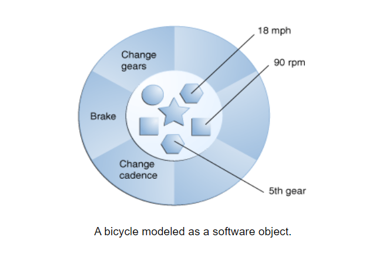
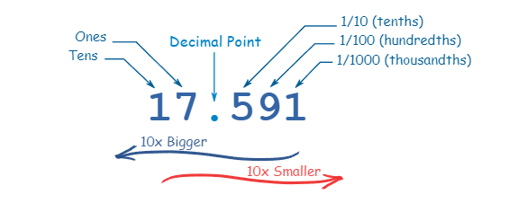
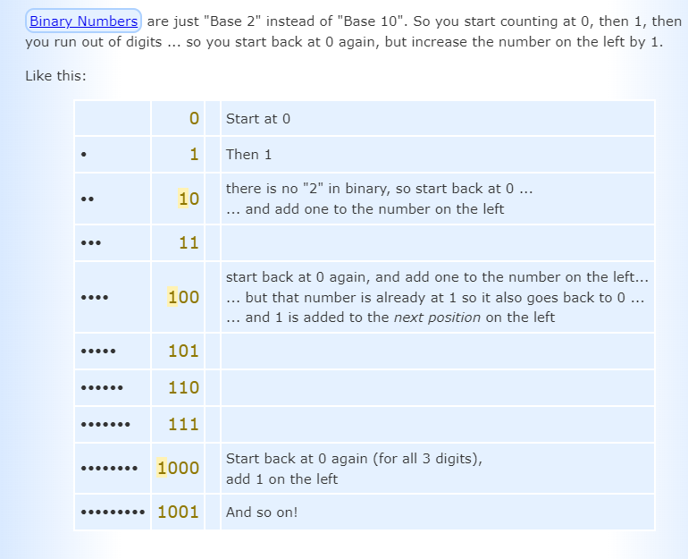
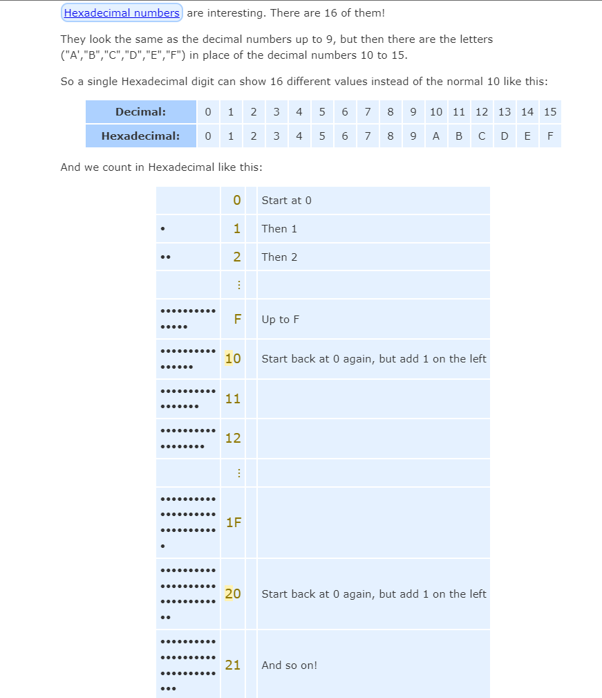

# Object-Oriented Programming

## What is an Object?

Software objects are conceptually similar to real-world objects, thay are consist state and behvior.
the state is stored in **fields** while exposes its behavior through methods.



1. Modularity: The source code for an object can be written and maintained independently of the source code for other objects. Once created, an object can be easily passed around inside the system.
2. Information-hiding: By interacting only with an object's methods, the details of its internal implementation remain hidden from the outside world.
3. Code re-use: If an object already exists (perhaps written by another software developer), you can use that object in your program. This allows specialists to implement/test/debug complex, task-specific objects, which you can then trust to run in your own code.
4. Pluggability and debugging ease: If a particular object turns out to be problematic, you can simply remove it from your application and plug in a different object as its replacement. This is analogous to fixing mechanical problems in the real world. If a bolt breaks, you replace it, not the entire machine.

## What Is a Class?

Class is a set of object, it represents  the blueprint from which individual objects are created, class doesn't contain a ```main``` method.

**Example:**

```JAVA
public class Bicycle {
        
    // the Bicycle class has
    // three fields
    public int cadence;
    public int gear;
    public int speed;
        
    // the Bicycle class has
    // one constructor
    public Bicycle(int startCadence, int startSpeed, int startGear) {
        gear = startGear;
        cadence = startCadence;
        speed = startSpeed;
    }
        
    // the Bicycle class has
    // four methods
    public void setCadence(int newValue) {
        cadence = newValue;
    }
        
    public void setGear(int newValue) {
        gear = newValue;
    }
        
    public void applyBrake(int decrement) {
        speed -= decrement;
    }
        
    public void speedUp(int increment) {
        speed += increment;
    }
        
}
```

```JAVA
// the MountainBike subclass has
    // one field
    public int seatHeight;

    // the MountainBike subclass has
    // one constructor
    public MountainBike(int startHeight, int startCadence,
                        int startSpeed, int startGear) {
        super(startCadence, startSpeed, startGear);
        seatHeight = startHeight;
    }   
        
    // the MountainBike subclass has
    // one method
    public void setHeight(int newValue) {
        seatHeight = newValue;
    }   

}
```

## Binary, Decimal and Hexadecimal Numbers

### Decimal

Every digit in a decimal number has a "position", and the decimal point helps us to know which position is which:



### Bases

Bases consisting of 10 symbols as it called **Base 10**
**0, 1, 2, 3, 4, 5, 6, 7, 8 and 9**


### Binary Numbers

Binary numbers is **Base 2** that means that it only consists of two numbers **1 and 0**



### Hexadecimal Numbers


