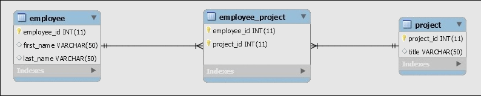

# Web App Security

A many-to-many relationship exists when one or more items in one table can have a relationship to one or more items in another table.
to avoid any problem, you can break the many-to-many relationship into two one-to-many relationships by using a third table, called a join table.


## Hibernate Many to Many Annotation Tutorial



1. **Database Setup**

    ```sql
    CREATE TABLE `employee` (
    `employee_id` int(11) NOT NULL AUTO_INCREMENT,
    `first_name` varchar(50) DEFAULT NULL,
    `last_name` varchar(50) DEFAULT NULL,
    PRIMARY KEY (`employee_id`)
        ) ENGINE=InnoDB AUTO_INCREMENT=17 DEFAULT CHARSET=utf8;

        CREATE TABLE `project` (
        `project_id` int(11) NOT NULL AUTO_INCREMENT,
        `title` varchar(50) DEFAULT NULL,
        PRIMARY KEY (`project_id`)
        ) ENGINE=InnoDB AUTO_INCREMENT=18 DEFAULT CHARSET=utf8;

        CREATE TABLE `employee_project` (
        `employee_id` int(11) NOT NULL,
        `project_id` int(11) NOT NULL,
        PRIMARY KEY (`employee_id`,`project_id`),
        KEY `project_id` (`project_id`),
        CONSTRAINT `employee_project_ibfk_1` 
        FOREIGN KEY (`employee_id`) REFERENCES `employee` (`employee_id`),
        CONSTRAINT `employee_project_ibfk_2` 
        FOREIGN KEY (`project_id`) REFERENCES `project` (`project_id`)
            ) ENGINE=InnoDB DEFAUL CHARSET=utf8;
    ```

2. **The Model Classes**

    The model classes Employee and Project need to be created with JPA annotations

    ```Java
    @Entity
    @Table(name = "Employee")
    public class Employee { 
        // ...
    
        @ManyToMany(cascade = { CascadeType.ALL })
        @JoinTable(
            name = "Employee_Project", 
            joinColumns = { @JoinColumn(name = "employee_id") }, 
            inverseJoinColumns = { @JoinColumn(name = "project_id") }
        )
        Set<Project> projects = new HashSet<>();
    
        // standard constructor/getters/setters
    }
    ```

    both the Employee class and Project classes refer to one another, which means that the association between them is bidirectional.

    the **@ManyToMany** used in both classes

3. **Execution**

    to test the many-to-many:

    ```Java
        @Test
            public void givenSession_whenRead_thenReturnsMtoMdata() {
            prepareData();
                @SuppressWarnings("unchecked")
            List<Employee> employeeList = session.createQuery("FROM Employee").list();
                @SuppressWarnings("unchecked")
            List<Project> projectList = session.createQuery("FROM Project").list();
                assertNotNull(employeeList);
                assertNotNull(projectList);
                assertEquals(2, employeeList.size());
                assertEquals(2, projectList.size());
            
                for(Employee employee : employeeList) {
                assertNotNull(employee.getProjects());
                assertEquals(2, employee.getProjects().size());
                }
                for(Project project : projectList) {
                assertNotNull(project.getEmployees());
                assertEquals(2, project.getEmployees().size());
                }
            }
    ```

    ```Java
        private void prepareData() {
            String[] employeeData = { "Peter Oven", "Allan Norman" };
            String[] projectData = { "IT Project", "Networking Project" };
            Set<Project> projects = new HashSet<Project>();

            for (String proj : projectData) {
            projects.add(new Project(proj));
            }

            for (String emp : employeeData) {
            Employee employee = new Employee(emp.split(" ")[0], emp.split(" ")[1]);
            employee.setProjects(projects);
                
                for (Project proj : projects) {
                proj.getEmployees().add(employee);
            }
                
            session.persist(employee);
            }
        }
    ```
